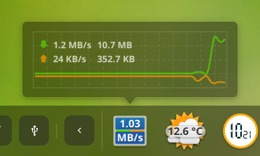
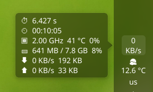
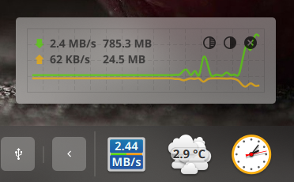

Deepin dock net speed plugin
=====================

This is a network speed plugin, mouse hover shows boot time, CPU info, memory usage, download and upload bytes.
Press the center mouse button to display the floating widget.





### Installation Guide ###
Compiling using Qt Creator or using the following command:
```
mkdir build
cd build
qmake ..
make
```
Installation: 
```
./install.sh
```

Uninstall:
```
./uninstall.sh
```
### Acknowledgment ###
This Plugin was initially inspired by [Sonichy's CMDU_DDE_DOCK](https://github.com/sonichy/CMDU_DDE_DOCK)